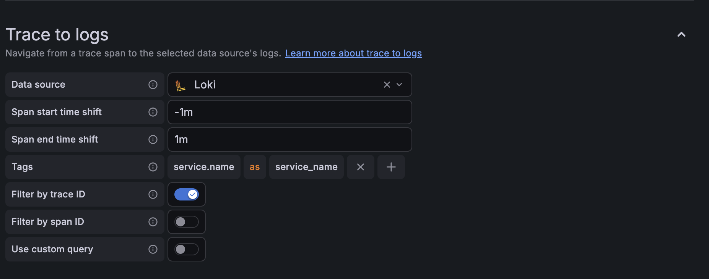

# Elixir Phoenix OpenTelemetry Example

This example demonstrates a Phoenix application with comprehensive observability:
- **Traces**: OpenTelemetry distributed tracing
- **Metrics**: Prometheus metrics via Telemetry  
- **Logs**: Structured JSON logging


## Dependencies

- Docker

## Quick Start

Start the example with metrics:

```bash
cd examples/elixir_phx
docker compose up --build
```

## Viewing Metrics

### Available Endpoints

- Application: [`http://localhost:4000/`](http://localhost:4000/)
- Dice rolling: [`http://localhost:4000/rolldice/6`](http://localhost:4000/rolldice/6)  
- Prometheus metrics: [`http://localhost:9586/metrics`](http://localhost:9586/metrics)
- Grafana: [`http://localhost:3000/`](http://localhost:3000/) (admin/admin)
- Prometheus UI: [`http://localhost:9090/`](http://localhost:9090/)

### Grafana Dashboard

1. Open Grafana at [`http://localhost:3000/`](http://localhost:3000/)
2. Login with admin/admin 

## Local Development

`cd examples/elixir_phx`

Start everything

```bash
docker compose up --build
```

Now you can visit [`http://localhost:4000/rolldice`](http://localhost:4000/rolldice) from your browser

start a separate iex session

```bash
docker compose exec -it app iex
```

If you're developing and would like to restart the running app

```bash
docker compose up --build -d app
```

start a psql session

```bash
docker compose exec -it db psql -U postgres
```

Stop docker services

```bash
docker compose down
```

## External Telemetry Services

By default, the LGTM collector only stores telemetry locally (Grafana, Tempo, Loki).
To also forward telemetry to external services like Honeycomb, Grafana Cloud, or other OTLP-compatible endpoints:

### Setup

1. Copy the example configuration:

   ```bash
   cp .env.lgtm.example .env.lgtm
   ```

2. Edit `.env.lgtm` with your service credentials

3. Restart lgtm services:

   ```bash
   docker compose up -d lgtm
   ```

### Grafana Notes

You'll want to use the settings below for proper traces -> logs correlation

Edit these settings here: [http://localhost:3000/connections/datasources/edit/tempo](http://localhost:3000/connections/datasources/edit/tempo)



## TODOs

- Add metrics
- Add sampling examples
- Ecto examples with SQL statements
- Examples with db.connection errors as well. Show the SQL statment that failed on timeouts
- Make an external call via Req to see tracing across services
